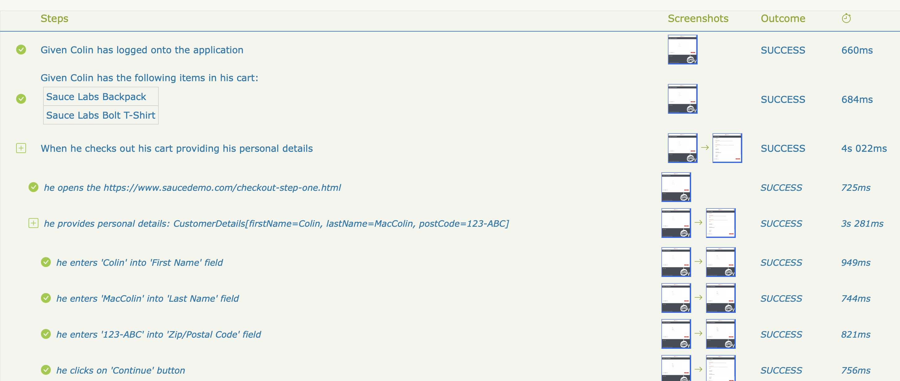
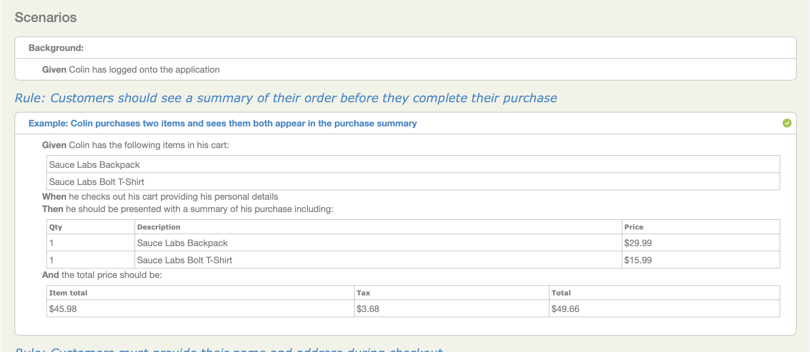
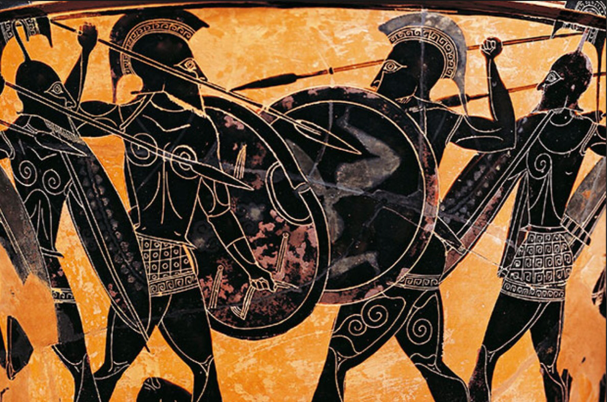

# Introduction

Serenity BDD is an open source library that aims to make the idea of living documentation a reality.

Serenity BDD helps you write cleaner and more maintainable automated acceptance and regression tests faster. Serenity also uses the test results to produce illustrated, narrative reports that document and describe what your application does and how it works. Serenity tells you not only what tests have been executed, but more importantly, what requirements have been tested.

One key advantage of using Serenity BDD is that you do not have to invest time in building and maintaining your own automation framework. Serenity BDD provides strong support for different types of automated acceptance testing, including:
- Web testing with Selenium.
- REST API testing with RestAssured.
- Highly readable, maintainable and scalable automated testing with the Screenplay pattern.
- BDD-style executable specifications with Cucumber

Serenity not only reports on what requirements were tested, it also reports on _how_ they were tested. It includes step-by-step details of how a test played out, including optional screenshots, so your tests truly document what your application does.

But Serenity is not just about reporting. The underlying aim of Serenity is to make it easy to quickly write well-structured, maintainable automated acceptance criteria, using your favourite BDD or conventional testing library. You can work with Behaviour-Driven-Development tools like Cucumber, or simply use JUnit (4 or 5). You can integrate with requirements stored in an external source (such as JIRA or any other test cases management tool), or just use a simple directory-based approach to organise your requirements.

Serenity also provides a host of built-in features that make coding your test automation faster and more reliable. Testers working with Serenity typically report automating tests with less than half the code they would need for a conventional Selenium test.

:::info
Up until November 2014, Serenity went by the name of Thucydides. Thucydides was an Ancient Greek historian who wrote about the Peloponnesian War in the late 5th Century BCE. He was the first historian to write about events that he actually participated in, and in many cases, he wrote down the events that he directly witnessed.

In a similar way Serenity BDD not only reports on test outcomes, but also records and documents how each scenario plays out, giving a particularly rich form of test reporting and living documentation.
:::

